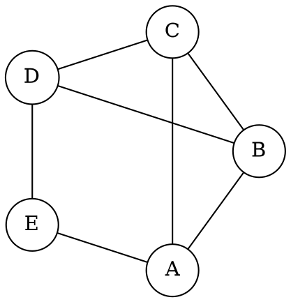

# docsify-viz

Yet another docsify plugin for rendering graphviz dot files.

## Installation

Add the following script tags to your `index.html`:

```html
<script src="//unpkg.com/svg-pan-zoom@3/dist/svg-pan-zoom.min.js"></script>
<script src="//unpkg.com/@viz-js/viz@3/lib/viz-standalone.js"></script>
<script src="//unpkg.com/@hrz6976/docsify-viz@1/dist/docsify-viz.min.js"></script>
```

## Usage

```markdown

### You can wrap your graphviz code in a code block:



### Or add an .dot image:


```

## Attribution

This plugin is inspired by:

- [cherrot/docsify-graphviz](https://github.com/cherrot/docsify-graphviz)
- [dreampuf/GraphvizOnline](https://github.com/dreampuf/GraphvizOnline)
- [Leward/mermaid-docsify](https://github.com/Leward/mermaid-docsify)