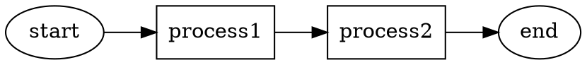

# Headline

> An awesome project.

### Viz

```graphviz
digraph workflow {
    rankdir=LR;
    start [shape=oval];
    process1 [shape=box];
    process2 [shape=box];
    end [shape=oval];
    
    start -> process1;
    process1 -> process2;
    process2 -> end;
}
```

