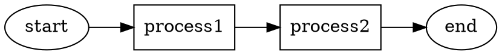
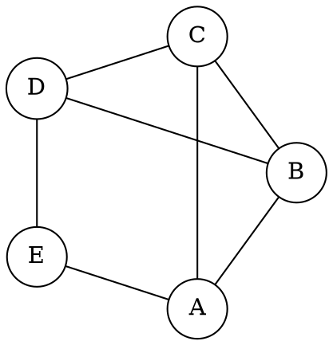

# Another Page

> An another awesome project.

### Viz

```graphviz
digraph workflow {
    rankdir=LR;
    start [shape=oval];
    process1 [shape=box];
    process2 [shape=box];
    end [shape=oval];
    
    start -> process1;
    process1 -> process2;
    process2 -> end;
}
```

```graphviz
graph network {
    layout=circo;
    node [shape=circle];
    
    A -- B;
    B -- C;
    C -- D;
    D -- E;
    E -- A;
    A -- C;
    B -- D;
}
```
